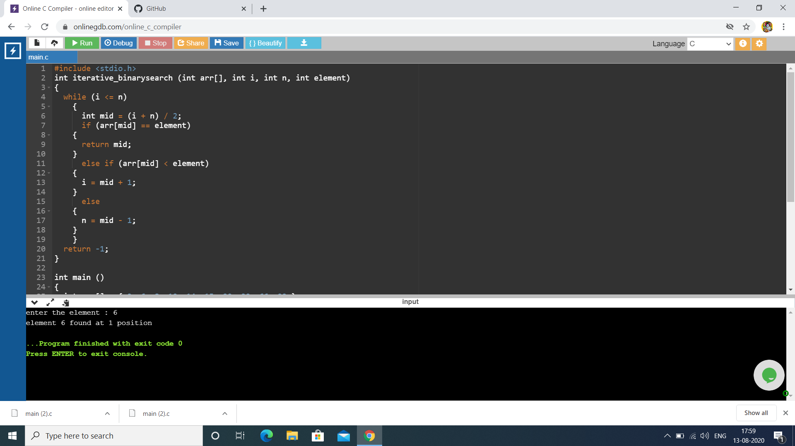

# Aim :                                                                                                 
To write a program using non-recursive function to perform Binary search operations for a Key element in the given list of integers. 
# Description :
Binary Search: Search a sorted array by repeatedly dividing the search interval in half.                 
Binary Search is applied on the sorted array or list of large size. It's time complexity of O(log n) makes it very fast as compared to other sorting algorithms.                                             
The only limitation is that the array or list of elements must be sorted for the binary search algorithm to work on it.                           
Following are the steps of implementation that we will be following:                                     
1. Start with the middle element:                                                                       
  If the target value is equal to the middle element of the array, then return the index of the middle    element.                                                                                                 
  -> If not, then compare the middle element with the target value,                                     
  -> If the target value is greater than the number in the middle index, then pick the elements to the right of the middle index, and start with Step 1.                                                       
  -> If the target value is less than the number in the middle index, then pick the elements to the left of the middle index, and start with Step 1.          
2. When a match is found, return the index of the element matched.
3. If no match is found, then return -1                            
# Step-by-step peocedure : 
1. List of integers : arr[] = {3,6,8,10,14,15,20,30,66,99}                                           
2. Case-1 : keyelement = 6                                                                           
Initially,                                                                                           
### Iteration-1:                                                                                   
  start index(i) =0 , end index(n) = 9 ,                                                     
  middle index(mid) = (i + n) / 2 = 4                                                                
  arr[4] = 14                                                                                         
  element < arr[4]                                                                                   
  So, the end index becomes mid - 1                                                                   
### Iteration-2 :
  n = mid - 1 = 3                                                                                     
  and mid = (0 + 3)/2 = 2                                                                             
  arr[2] = 8                                                                                         
  element < arr[2]                                                                                   
### Iteration-3 :
  n = mid - 1 = 2                                                                                     
  mid = 1                                                                                             
  arr[1] = 6                                                                                         
  element == arr[1]                                                                                   
  Here the condition satisfies and returns final mid value i.e 1                                     
  Output of following case is : element found at 1 position                                           
  
