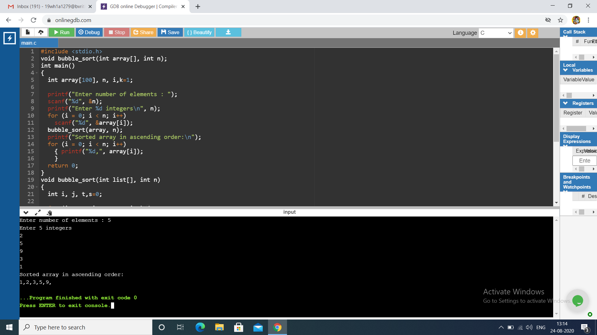
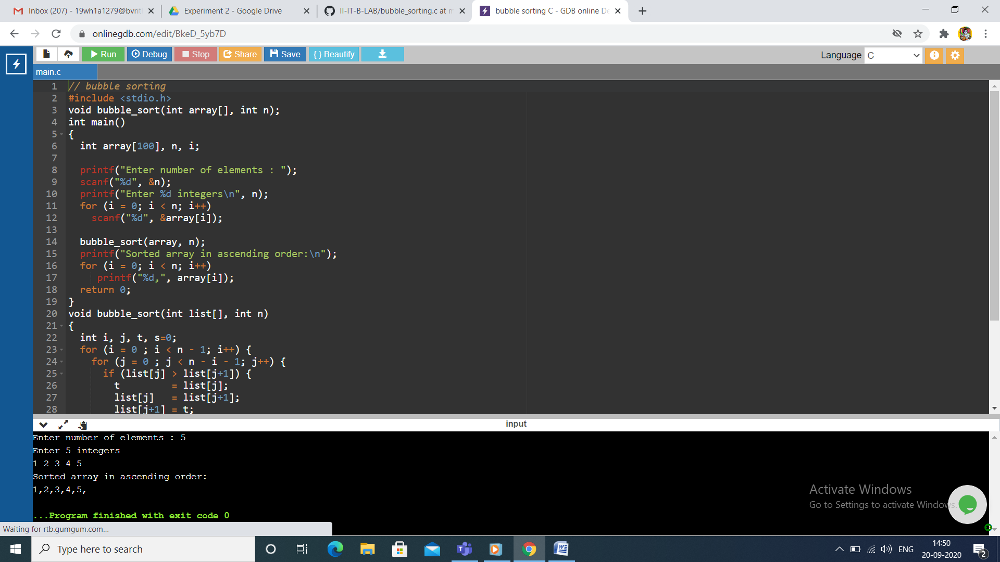
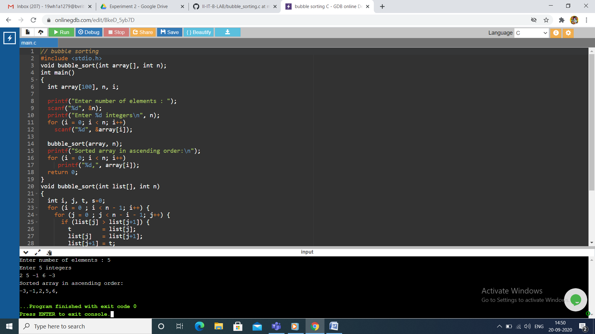

# Aim : 
To write a program to perform bubble sort operation for the given list of integers
# Description :
Bubble Sort is the simplest sorting algorithm that works by repeatedly swapping the adjacent elements if they are in wrong order.                                                                                   
Bubble sort has a worst-case and average complexity of О(n*n), best case is O(n)                           
# Step-by-step procedure : 
### Case-1: 
array = [2,5,9,3,1]                                                                                     
It is an unsorted array ,so it starts by comparing with first 2 elements.                               
#### Iteration 1 :                                                                                    
2 is compared with 5, 2 is small then 5 so no swaping takes place                                       
Then 5,9 are compared , 5 < 9 so no swaping takes place.                                               
Then 9,3 are compared , 9 > 3 so swaping takes place and array becomes as [2,5,3,9,1]                   
Finally 9,1 are compared, 9 > 1 so swaping takes place and array becomes as [2,5,3,1,9]                 
#### Iteration 2 :
2 is compared with 5, 2 is small then 5 so no swaping takes place                                       
Then 5,3 are compared , 5 > 3 so swaping takes place and array becomes as [2,3,5,1,9]                   
Then 5,1 are compared , 5 > 1 so swaping takes place and array becomes as [2,3,1,5,9]                   
Finally 5,9 are compared, 9 > 5 so no swaping takes place.                                             
#### Iteration 3 :
2 is compared with 3, 2 is small then 3 so no swaping takes place                                       
Then 3,1 are compared , 3 > 1 so swaping takes place and array becomes as [2,1,3,5,9].                 
Then 3,5 are compared , 5 > 3 so no swaping takes place                                                 
Finally 5,9 are compared, 9 > 5 so no swaping takes place.                                             
#### Iteration 4 :
2 is compared with 1, 2 is greater then 1 so swaping takes place and arry becomes as [1,2,3,5,9].       
Then 2,3 are compared , 2 < 3 so no swaping takes place.                                               
Then 3,5 are compared , 5 > 3 so no swaping takes place                                                 
Finally 5,9 are compared, 9 > 5 so no swaping takes place
#### Iteration 5 :
Here the array is sorted ,so no swaping takes place and it comes out of loop.                           
#### Output of following case is : [1,2,3,5,9].

### Case-2 : 
array = [1,2,3,4,5]                                                                                     
#### Iteration 1 :
Here it is already sorted array ,so it s will remain as 0 and it comes out of loop.                    
The final array is same as given array                                                                 
#### Output of following case is : [1,2,3,4,5].

### Case-3 : 
array = [2,5,-1,6,-3]                                                                                   
#### Iteration 1 :
2 is compared with 5, 2 is small then 5 so no swaping takes place.                                     
Then 5,-1 are compared, as 5 > -1, so swaping takes place and array becomes as [2,-1,5,6,-3]           
Then 5,6 are compared , as 5 < 6 so no swaping takes place.                                             
Finally 6 and -3 are compared, as 6 > -3 so swaping takes place and array becomes as [2,-1,5,-3,6]
#### Iteration 2:
-1 is compared with 2, 2 is greater then -1 so swaping takes place and array becomes as [-1,2,5,-3,6]   
Then 2, 5 are compared, as 5 > 2, so no swaping takes place.                                           
Then 5,-3 are compared , as 5 > -3 so swaping takes place and array becomes as [-1,2,-3,5,6]           
Finally 5 and 6 are compared, as 6 > 5 so no swaping takes place.
#### Iteration 3 :
-1 is compared with 2, 2 is greater then -1 so no swaping takes place.                                 
Then 2, -3 are compared, as 2 > -3, so swaping takes place and array becomes as [-1,-3,2,5,6]           
Then 2, 5 are compared , as 5 > 2 so no swaping takes place.                                           
Finally 5 and 6 are compared, as 6 > 5 so no swaping takes place.
#### Iteration 4 :
Here the array is in correct order. So it comes out of loop                                             
And finnal array is [-1,-3,2,5,6]

